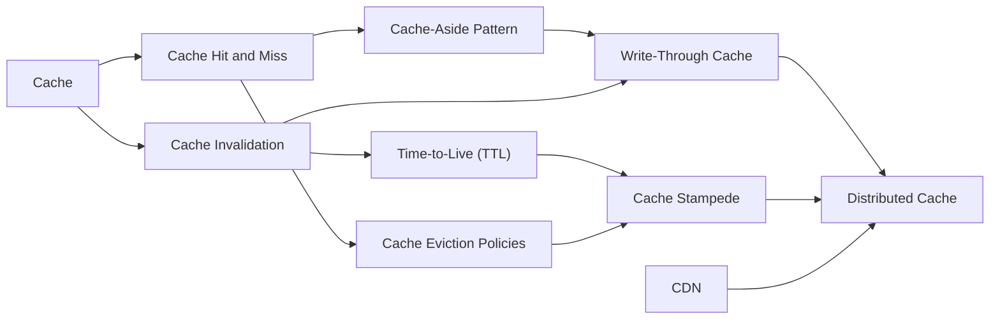
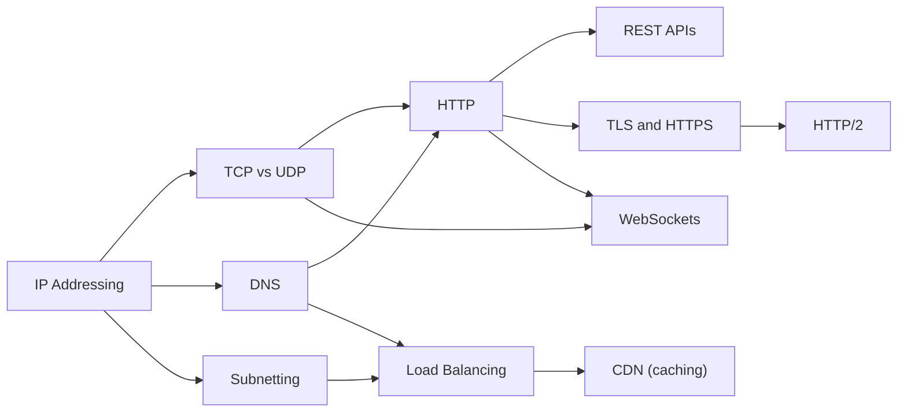

# The toastcrumb concept graph

This is the map behind [toastcrumb](https://www.toastcrumb.com) — 20 software-engineering concepts across 2 domains, and the prerequisite edges that say what to learn before what. Every arrow points from a prerequisite to the concept it unlocks, so you can read a domain diagram top-to-bottom as a learning order. The machine-readable version of exactly this data is [`graph.json`](./graph.json).

> Generated from the concept library by `pnpm content:export-graph`. **Do not edit by hand** — edits are overwritten on the next export, and CI fails when this file is stale.

## What's here and what isn't

**Here:** the complete graph — every concept's id, title, description, difficulty (1–4), domain, prerequisites and next-concepts. All of it, for all concepts.

**Not here:** the lessons. The cards, quizzes, answer options and explanations that teach each concept are the product, and they live in the app at [https://www.toastcrumb.com](https://www.toastcrumb.com). The per-concept real-world scenarios (`contexts`) are also excluded.

**In the public repo, that means an asymmetry — by design:** `graph/` covers every concept, while `content/concepts/` there holds only a small sample of full lessons. A short graph and a long one are not out of sync; the graph is the published map, the sample is a taste of the lessons.

The diagrams draw **prerequisite** edges only. A concept's `next` list is authored separately and is almost always the mirror image; where it isn't, the tables below are the complete record.

## Caching

10 concepts.

Cross-domain in: **CDN** needs **Load Balancing** (networking) — that arrow is drawn in the other domain's diagram, not this one.

| Concept | Difficulty | What it is | Learn first | Then |
| --- | --- | --- | --- | --- |
| **Cache** | 1 | Keep a copy of frequently accessed data somewhere fast so you avoid repeating expensive fetches or computations. | — | Cache Hit and Miss, Cache Invalidation, CDN |
| **Cache Hit and Miss** | 1 | A cache hit means the data you need is already stored nearby; a cache miss means it is not, so the system must fetch it from the slower original source. | Cache | Cache Eviction Policies, Cache-Aside Pattern |
| **Cache-Aside Pattern** | 2 | The application checks the cache first, and on a miss it fetches from the database and writes the result back into the cache itself before returning it. | Cache Hit and Miss | Write-Through Cache |
| **Cache Eviction Policies** | 2 | When a cache is full, a policy such as Least Recently Used or Least Frequently Used decides which existing entries to drop to make room for new ones. | Cache Hit and Miss | Cache Stampede |
| **Cache Invalidation** | 2 | Removing or updating stale entries in a cache so callers never read outdated data after the underlying source changes. | Cache | Time-to-Live (TTL), Write-Through Cache |
| **Time-to-Live (TTL)** | 2 | Attach an expiry duration to each cached entry so it is automatically discarded after a set number of seconds, preventing data from going stale indefinitely. | Cache Invalidation | Cache Stampede |
| **Cache Stampede** | 3 | When a popular cached entry expires, many concurrent requests all miss at once and simultaneously hit the database before the cache is repopulated, briefly overwhelming the system. | Time-to-Live (TTL), Cache Eviction Policies | Distributed Cache |
| **CDN** | 3 | A CDN caches copies of your static files on servers around the world so users fetch content from a nearby node rather than a single distant origin server. | Load Balancing | — |
| **Write-Through Cache** | 3 | Every write goes to the cache and the underlying data store at the same time, keeping them always in sync at the cost of slightly slower individual writes. | Cache-Aside Pattern, Cache Invalidation | Distributed Cache |
| **Distributed Cache** | 4 | A cache layer spread across multiple machines (such as Redis Cluster) so no single node's memory limit or failure can take down the entire caching tier. | Write-Through Cache, Cache Stampede, CDN | — |

## Networking

10 concepts.

Cross-domain out: **CDN** (caching) — drawn above because a prerequisite edge starts in this domain and ends there.

| Concept | Difficulty | What it is | Learn first | Then |
| --- | --- | --- | --- | --- |
| **IP Addressing** | 1 | Every device on a network gets a unique numerical address so that data knows where to be sent and received. | — | DNS, Subnetting, TCP vs UDP |
| **TCP vs UDP** | 1 | TCP and UDP are the two main protocols that control how data is broken into packets and delivered, with TCP guaranteeing delivery and UDP prioritizing speed. | IP Addressing | HTTP, WebSockets |
| **DNS** | 2 | DNS is a global directory that translates human-readable domain names like google.com into the numerical IP addresses computers use to connect. | IP Addressing | HTTP, Load Balancing |
| **HTTP** | 2 | HTTP is the request-and-response protocol that browsers and servers use to exchange web pages and data over the internet. | TCP vs UDP, DNS | TLS and HTTPS, REST APIs, WebSockets |
| **REST APIs** | 2 | A REST API is a standardized way for programs to communicate over HTTP using plain URLs and verbs like GET, POST, and DELETE. | HTTP | — |
| **Subnetting** | 2 | Subnetting divides a large network into smaller logical groups so that traffic stays organized and security boundaries are easier to enforce. | IP Addressing | Load Balancing |
| **Load Balancing** | 3 | A load balancer spreads incoming requests across multiple servers so no single machine is overwhelmed and the service stays fast and available. | DNS, Subnetting | CDN |
| **TLS and HTTPS** | 3 | TLS encrypts data in transit between a client and server so that anyone eavesdropping on the network cannot read or alter it. | HTTP | HTTP/2 |
| **WebSockets** | 3 | WebSockets keep a persistent, two-way connection open between a client and server so data can stream in both directions without re-connecting for each message. | TCP vs UDP, HTTP | — |
| **HTTP/2** | 4 | HTTP/2 is an upgrade to HTTP that multiplexes multiple requests over one connection simultaneously, cutting the overhead that slows down modern web pages. | TLS and HTTPS | — |

## Licence

This export is content, not code: it is licensed **CC BY-NC 4.0**, the same licence as the rest of the concept library — see [`content/LICENSE`](../content/LICENSE). The app's code is Apache-2.0; the two licences are separate on purpose.
